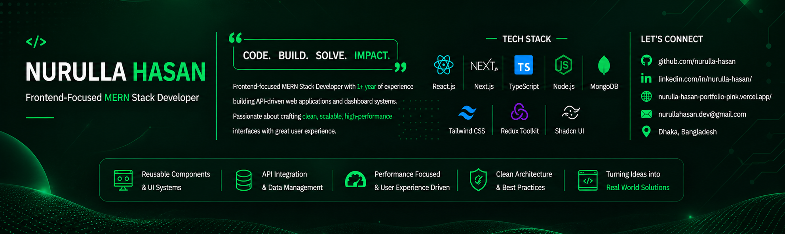

<div align="center">

<!-- Banner Header -->


<!-- Typing SVG -->


<!-- Profile Badges -->
<p>
  
  
  
</p>

</div>

---

## 👨‍💻 About Me

```ts
const nurulla = {
  name:       "Nurulla Hasan",
  role:       "Frontend-Focused MERN Stack Developer",
  company:    "Betopia Group",
  location:   "Dhaka, Bangladesh 📍",
  experience: "1+ Year",
  focus:      ["Scalable UI", "Clean Architecture", "API-Driven Apps"],
  contact:    "nurullahasan.dev@gmail.com",
};
```

- 🏢 Currently working at **Betopia Group** (On-site)
- 💡 Passionate about **component architecture & developer experience**
- 🎯 Specialized in **React, Next.js, TypeScript, and dashboard systems**
- 📖 Always sharpening skills — currently on Programming Hero Level 2

---

## 🛠️ Tech Stack

### 🎨 Frontend
<p>
  
</p>

`React.js` `Next.js (App Router)` `TypeScript` `JavaScript (ES6+)` `Tailwind CSS` `Shadcn UI` `Framer Motion`

### ⚙️ Backend
<p>
  
</p>

`Node.js` `Express.js` `MongoDB` `Mongoose` `REST API`

### 💾 State & Data Management
<p>
  
</p>

`Redux Toolkit` `RTK Query` `TanStack Query` `React Hook Form` `Zod` `Context API`

### 🔧 Tools & Workflow
<p>
  
</p>

`Git` `GitHub` `Vercel` `VS Code` `Postman`

---

## 🚀 Selected Projects

| Project | Tech | Live | Source |
|---------|------|------|--------|
| **MentorIP — Global IP Law Firm** | Next.js, TypeScript, Tailwind, Framer Motion | [🌐 Live](https://mentorip.com) | [📁 Repo](https://github.com/nurulla-hasan/mentorip_website) |
| **Wedding Marketplace & Vendor Platform** | Next.js, TypeScript, Tailwind, Shadcn UI | [🌐 Live](https://elevator-website-six.vercel.app/) | [📁 Repo](https://github.com/nurulla-hasan/elevator_website) |
| **Cookbook Recipe & Meal Planner** | React, Redux, JavaScript, Shadcn UI | [🌐 Live](https://koumanisdietapp.com) | [📁 Repo](https://github.com/nurulla-hasan/cookbook-recipe-website) |
| **Admin & Management Dashboard** | React, TypeScript, Redux Toolkit, RTK Query | [🌐 Live](https://mikefiremerritt-dashboard.vercel.app/auth/login) | [📁 Repo](https://github.com/nurulla-hasan/mikefiremerritt_dashboard) |

---

## 📊 GitHub Analytics

<div align="center">
  
</div>

<br/>

<div align="center">
  
  
</div>

---

## 🌐 Connect With Me

<div align="center">

[](https://www.linkedin.com/in/nurulla-hasan/)
[](https://github.com/nurulla-hasan)
[](https://nurulla-hasan-portfolio-pink.vercel.app/)
[](mailto:nurullahasan.dev@gmail.com)

</div>

---

<div align="center">
  
</div>
